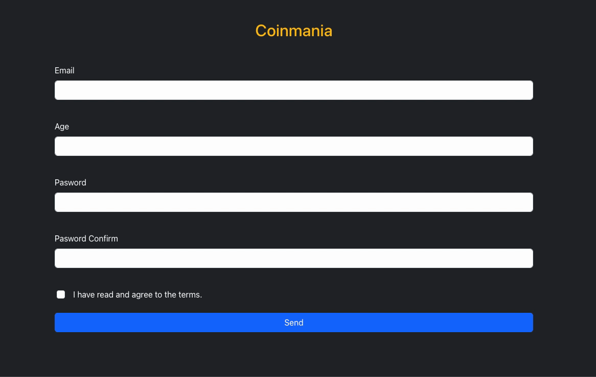

# Formik & Yup Form Validation

This project demonstrates a form implementation using Formik for form management and Yup for schema-based validation. The form includes fields for email, age, password, and password confirmation, with appropriate validation rules applied.

<h2> Programming Languages Used</h2>

Website is coded with JSX CSS/BOOTSRAP & REACT.JS

# Librarys
- Formik
- Yup
- Bootsrap

<h2>Screen </h2>

